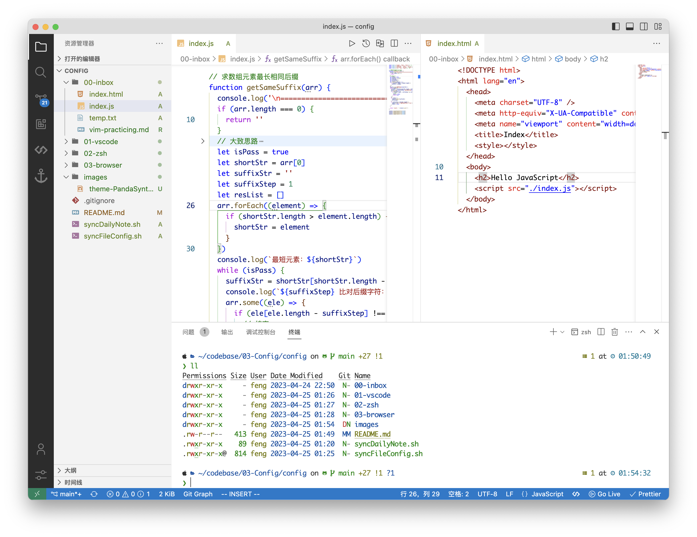
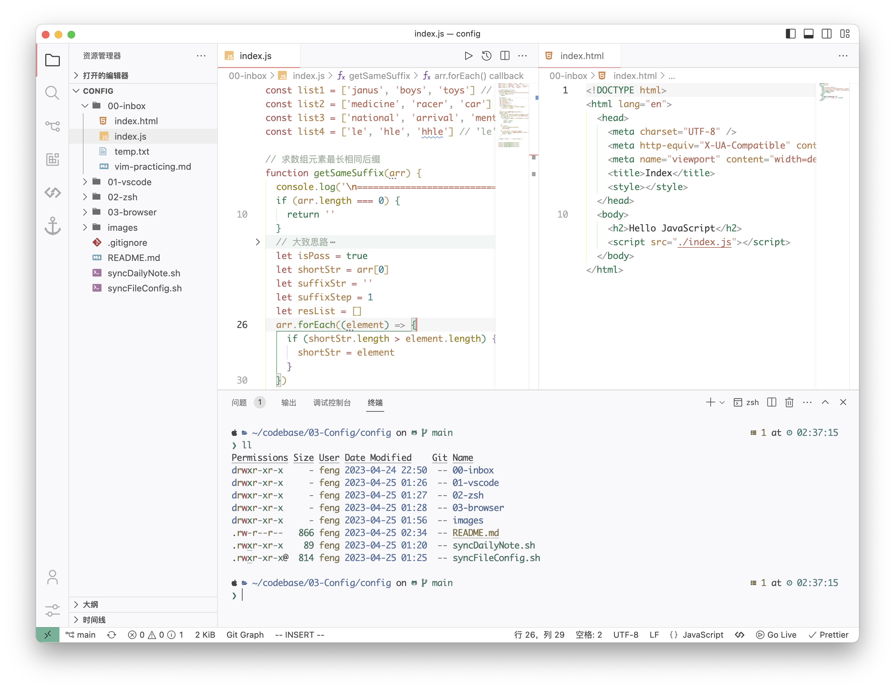
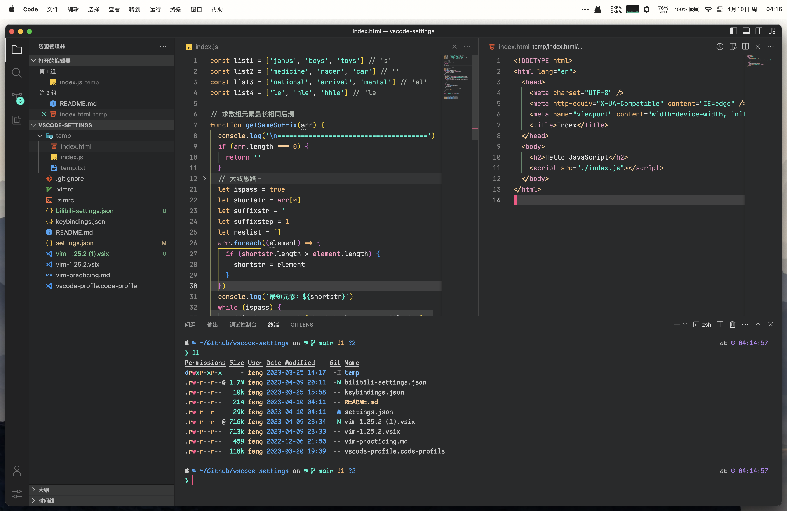

## My Config

### vscode

- [`settings.json`](./01-vscode/settings.json)
- [`settings-comments.json`](./01-vscode/settings-comments.json)
- [`keybindings.json`](./01-vscode/keybindings.json)

### zsh

- [`.vimrc`](./02-zsh/.vimrc)
- [`.zimrc`](./02-zsh/.zimrc)

<b>Preview</b>

<!--  -->

### Themes

> Default Light+ theme comes with the VS Code

- [Moegi Light Vitesse](https://github.com/moegi-design/vscode-theme)
- [Panda Syntax](https://github.com/tinkertrain/panda-syntax-vscode)

### Fonts

> Monaco font comes with the Mac system

- [Comic Shanns Font](https://github.com/shannpersand/comic-shanns)
- [JetBrains Mono Font](https://github.com/JetBrains/JetBrainsMono)
- [Fira Code](https://github.com/tonsky/FiraCode)
- [IBM Plex Mono](https://github.com/IBM/plex)
- [Input Mono](https://input.djr.com/)
