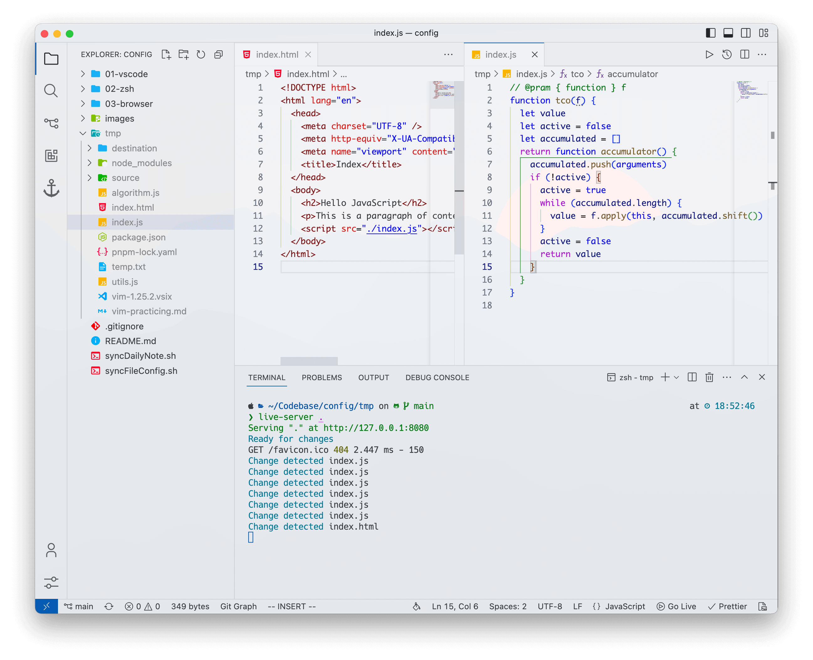
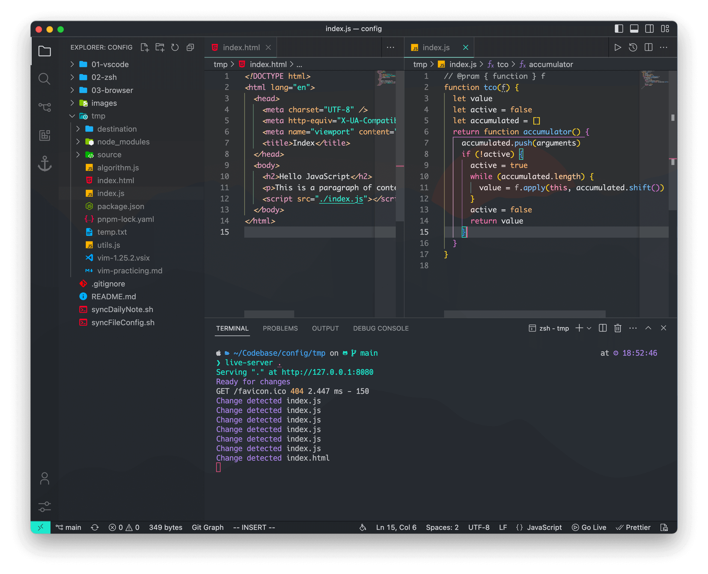
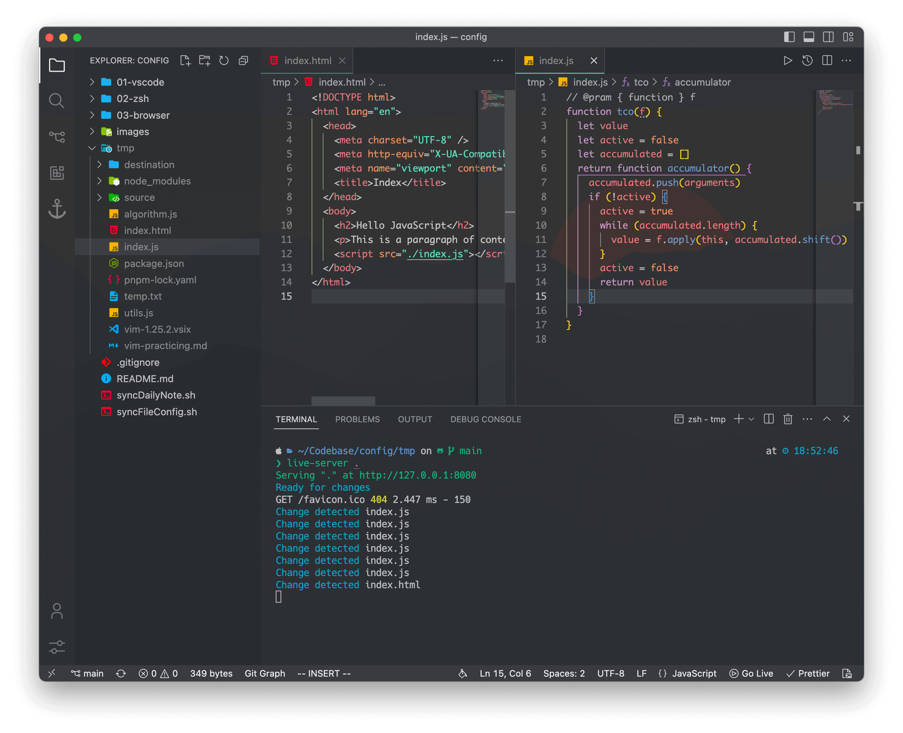

## My Config

### vscode

- [`settings.json`](./vscode/settings.json)
- [`keybindings.json`](./vscode/keybindings.json)

### zsh

- [`.vimrc`](./zsh/.vimrc)
- [`.zimrc`](./zsh/.zimrc)
- [`init.vim`](./zsh/init.vim)

<b>Preview</b>

<!--  -->

### Themes

> Light Modern theme comes with the VSCode

- [Panda Syntax](https://github.com/tinkertrain/panda-syntax-vscode)
- [Spacegray VSCode](https://github.com/mihai-vlc/spacegray-vscode)

### Fonts

> Monaco font comes with the Mac system

- [Comic Shanns Font](https://github.com/shannpersand/comic-shanns)
- [JetBrains Mono Font](https://github.com/JetBrains/JetBrainsMono)
- [Fira Code](https://github.com/tonsky/FiraCode)
- [IBM Plex Mono](https://github.com/IBM/plex)
- [Input Mono](https://input.djr.com/)
